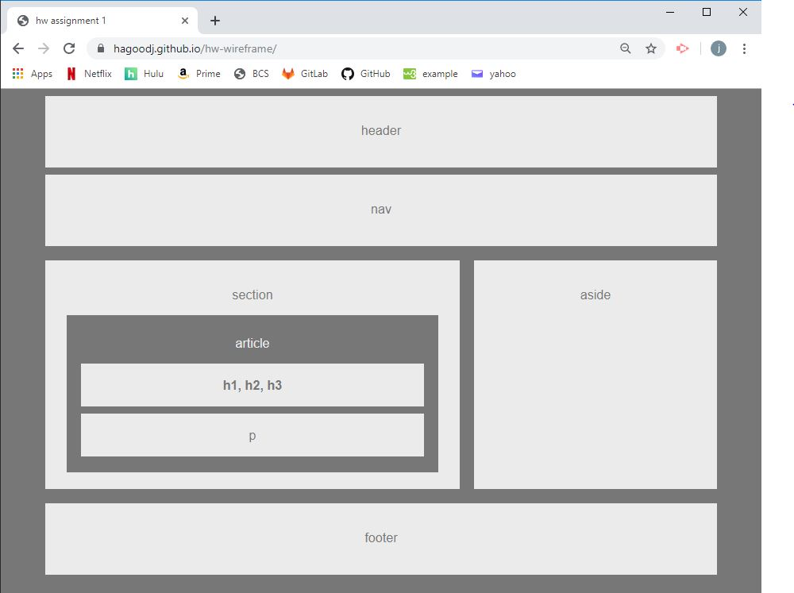

# Homework 1 Assignment

## Site Picture


## Technologies Used 
- HTML - Used to create elements on the DOM
- CSS - styles html elements on page 
- Git - version control system to track changes to source code
- Github - hosts repository that can be deployed to GitHub pages

## Summary
This is my completed homework 1 assignment due Thursday 8/22/2019. It contains some of the basic contents of a webpage. 

## Code Snippet
The following code contains each element of the webpage:
```html
<body>

    <header>
        <p>header</p>
    </header>

    <section id = "nav">
        <p>nav</p>
    </section>

    <section id = "section">

        <p>section</p>

        <section id = "article">

            <p>article</p>

            <section id = "headers">
               <strong>h1, h2, h3</strong>
            </section>

            <section id = "paragraph">
                p
            </section>
        </section>
    </section>

    <section id = "aside">
        <p>aside</p>
    </section>

    <footer>
        <p>footer</p>
    </footer>
</body>
```

## Authors
#### Jordan Hagood